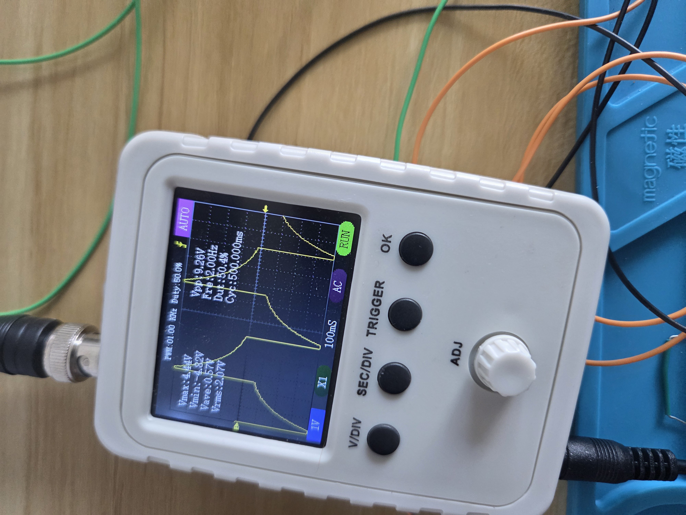
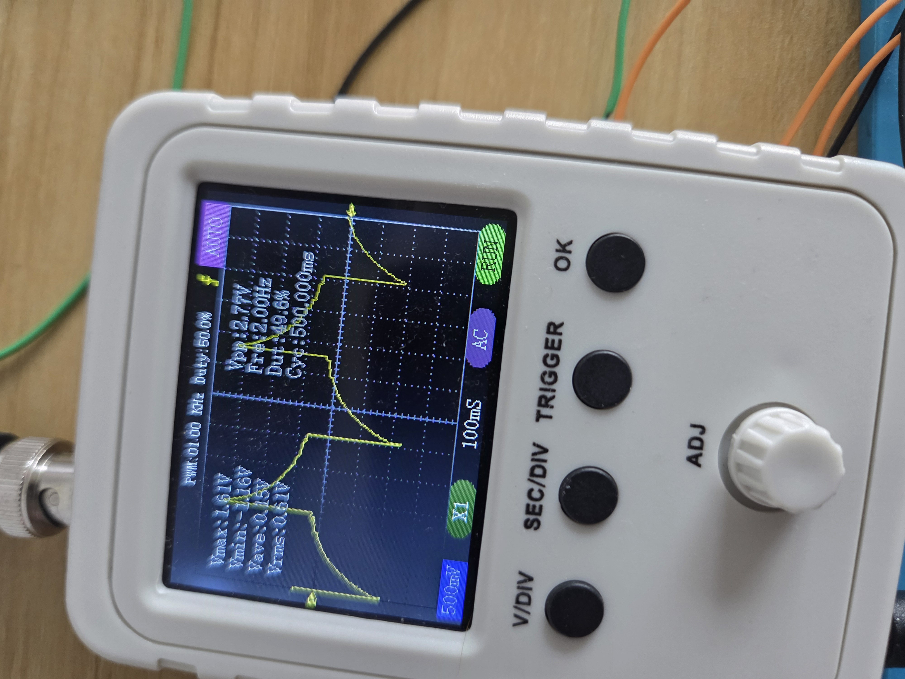

# Mon, 08.24.26 - Getting the differential tested
A little bit of testing showed that the ref problem was just due to my oscope. Adjusting the resolution balanced it out and made it much more stable.

Next step! Let's make the differential part work. The plan is to use the same signal from the arduino but put it through a voltage divider to make it smaller.

I used 10k x2 for the Vi1 for 2.5v square wave and a 220 and 100 resistor for Vi2 1.56v square wave.

Ideally: 2.5 - 1.56 = 1.06v square wave (approximately)

Because of my amplifier, I currently have a x2 gain resistor so *hopefully* I get a 2v square wave when I hook all this up.

## Output After Differential Signal

We did it!!

Now time to do some math to figure out our gain resistor for our actual EEG! We're looking at difference of less than 100 microvolts (per skimming [this paper](https://www.researchgate.net/publication/221258498_Development_of_Brainwave_Balancing_Index_Using_EEG#pf1)) and my oscope doesn't go lower than 5 millivolts. Ideally we'd want an amplification around 50-100x. Given the resistors I currently have, I can get the following gains:

| Gain resistor |      Gain | 100 µV input → output |
| ------------: | --------: | --------------------: |
|          10 Ω |     2001× |              200.1 mV |
|         100 Ω |      201× |               20.1 mV |
|     **220 Ω** |   **92×** |            **9.2 mV** |
|     **330 Ω** | **61.6×** |           **6.16 mV** |
|      **1 kΩ** |   **21×** |            **2.1 mV** |
|          2 kΩ |       11× |                1.1 mV |
|          5 kΩ |        5× |                0.5 mV |
|         10 kΩ |        3× |                0.3 mV |

We're gonna try this with our 220 and see what happens!

Unfortunately, we forgot an important aspect of electrodes: DC voltage. Due to wibbly wobbly stuff, the electrode output has a large DC component, on the order of 10Vs or more. So I need some filtering at the very least. On the plus side, this is a highly filterable. I ordered a capacitor kit since I somehow have *no* capacitors anywhere and I'll put together a handy highpass circuit when they come.