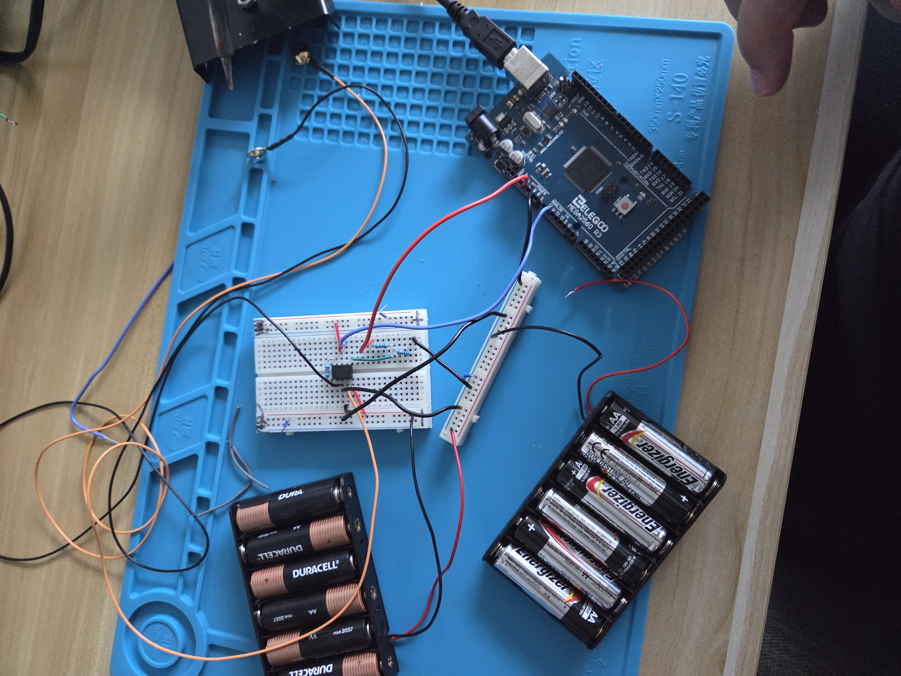

# Sat, 08.15.26 - Phase 1: Electrodes -> Amplifier ->  Arduino -> Computer
I started with the most basic setup I could do with what I had. My first thought was, "An electrode is just a sensor that picks up voltages right?" That was wrong. EEGs are actual ***differential*** signals. They answer the question, "What is the ***difference*** in voltage between two spots on the scalp."

I started off by just pulling out all the things I had for this project and writing them down. Then I refined my idea down to the most basic elements needed to get a signal from the electrode to the computer:
1. The electrode for obvious reasons
1. An amplifier because I know the signals coming off the electrode will be tiny
1. An ADC (Analog to Digital Circuit) because a computer can't read analog directly
1. A connection to my computer
1. Software to display the signal.

## Setup
Thankfully I had the exact instrumentation amplifier from the instructable and I was able to cobble together the power sources using a couple AA battery holders I had lying around. I needed +9V and -9V so I wired them in series and grounded them at the connection point to get the right bias.

The electrodes were pretty straight forward, I just cut off the connectors they came with, stripped the insulation, and soldered the ends so they were easier to put in the bread board.

I plunked my AD620AN into a bread board and started connecting the pins according to my diagram. 

## Wiring
I started by putting together the power supply circuit and then making sure my power rails on the breadboard were at 9V and -9V. Always probe your power rails kids. I also used a totally detached separate rail entirely for ground. I kinda like this approach even tho it looks a little messier because you can count the grounds on the separate rail to make sure you have the right number. 

## Software
I need to make two software features for this phase: 

1. The actual software to read out of Dout from the IC
2. Testing software to generate a signal that is kinda in the range of EEG or at least EEG enough to be sure everything is working-ish.

I have learned from experience not to put things on your head without testing to make sure they don't zap you, explode, or burn down the house.

I probed all my pins to make sure the voltages were correct on each pin and they were...***almost***.

## Voltage Probe Table — Inputs Grounded

> Reference: black multimeter probe on circuit GND unless otherwise noted.

| # | Probe point | Expected voltage | Measured voltage | Notes |
|---|---|---:|---:|---|
| 1 | Battery 1 + |+9 V |+9 V | |
| 2 | Battery 1 − / GND rail | 0 V | 0 V| |
| 3 | Battery 2 + |-9 V | -9 V| Remember the wire colors are reversed|
| 4 | Battery 2 − / GND rail | 0 V |0 V | Ditto above |
| 6 | +9 V rail at AD620 +Vs | +9 V | +9 V| AD620 pin 7 |
| 7 | −9 V rail at AD620 −Vs | −9 V | -9 V | AD620 pin 4 |
| 8 | Arduino 5V | +5 V | +5 V | |
| 9 | Arduino GND | 0 V | 0 V| |
| 10 | 10k/10k divider — top | +5 V | +5 V | Connected to Arduino 5V |
| 11 | 10k/10k divider — midpoint / 2.5V REF | +2.5 V | +2.5 V| AD620 REF |
| 12 | 10k/10k divider — bottom | 0 V | 0 V | GND |
| 13 | Electrode 1 / +EEG node | 0 V | | Input grounded |
| 14 | Electrode 2 / -EEG node | 0 V |  | Input grounded |
| 15 | AD620 +IN | 0 V | 0 V | Pin 3 |
| 16 | AD620 -IN | 0 V | 0 V | Pin 2 |
| 17 | AD620 +IN relative to -IN | ~0 V | | Red = +IN, black = -IN |
| 18 | AD620 G1 | Same as G2 | | Gain resistor endpoint |
| 19 | AD620 G2 | Same as G1 | | Gain resistor endpoint |
| 20 | Across 5.1k gain resistor (G1 → G2) | ~0 V | | |
| 21 | AD620 REF | +2.5 V | | Pin 5 |
| 22 | AD620 OUT | ~+2.5 V | | Pin 6, with both inputs at 0 V |
| 23 | Arduino A0 | ~+2.5 V | | Same electrical node as AD620 OUT |
| 24 | AD620

## Differential Measurements

> For these, put the probes directly across the two named nodes.

| # | Red probe | Black probe | Expected voltage | Measured voltage |
|---|---|---|---:|---:|
| D1 | Battery 1 + | Battery 1 − | | |
| D2 | Battery 2 + | Battery 2 − | | |
| D3 | Battery 1 + | Battery 2 + | | |
| D4 | Divider 1 midpoint | GND | | |
| D5 | Divider 2 midpoint | GND | | |
| D6 | Op-amp + input | Op-amp − input | ~0 V* | |
| D7 | Notch filter input | GND | | |
| D8 | Notch filter output | GND | | |
| D9 | Final output | GND | | |

Unfortunately this is about where I'm stuck. All the voltages I measured are correct but something about the way the arduino is interacting is weird. I get -0.8v at the output pin 6 when pins 2 and 3 are pulled to ground. Connecting up the arduino I also see that there's some backfeed of the power into the ground pin :grimace:. Not sure what's wrong but that's a tomorrow problem.

In the meantime, here's the software plan!

**Processing Software**

- Arduino -> Sample A0 and turn on ADC for it -> Serial Port
- Python -> Read from Serial display real time -> Processing
- Alt: Matlab?

**Testing Signal**

- Arduino -> Output PWM (or sine-ish) for EEG+
- Same signal but with a resistor to drop the voltage a bit for EEG-??
