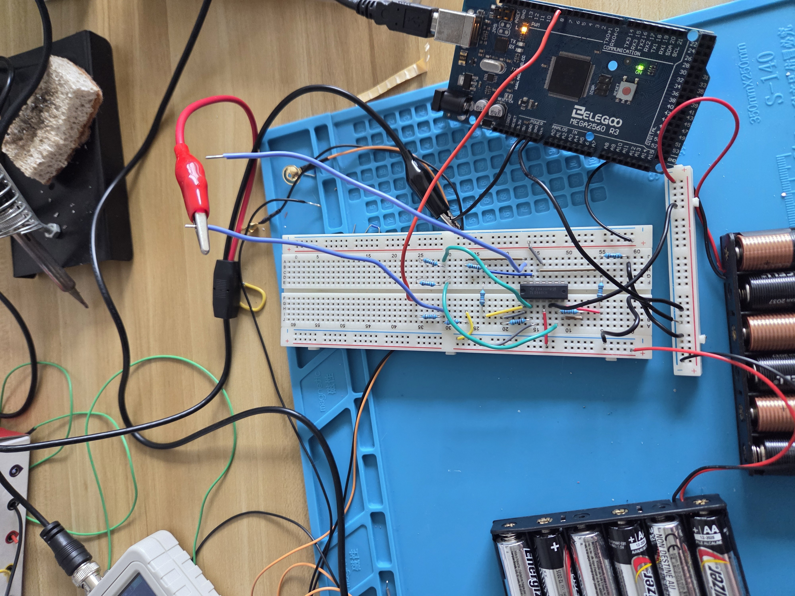
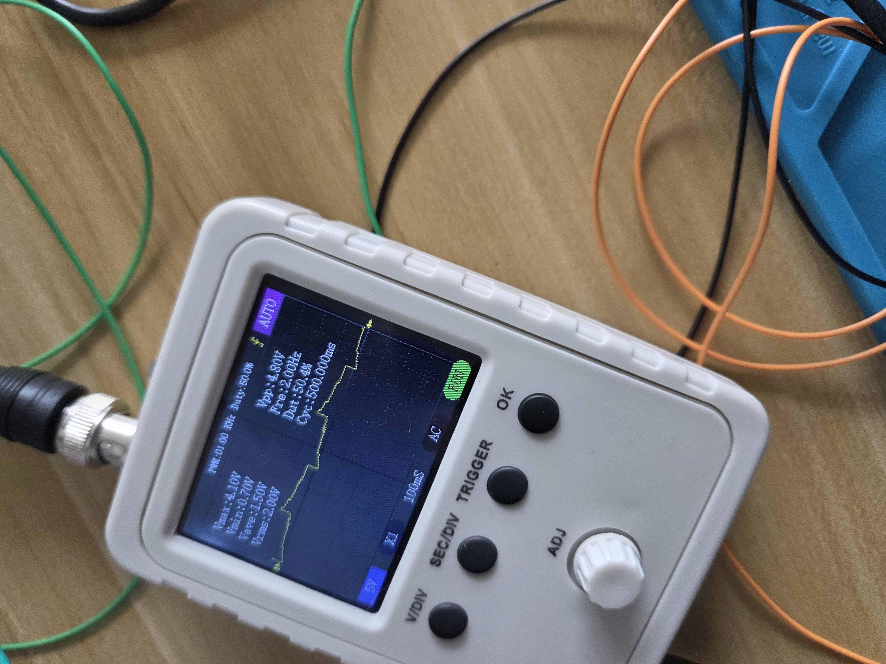
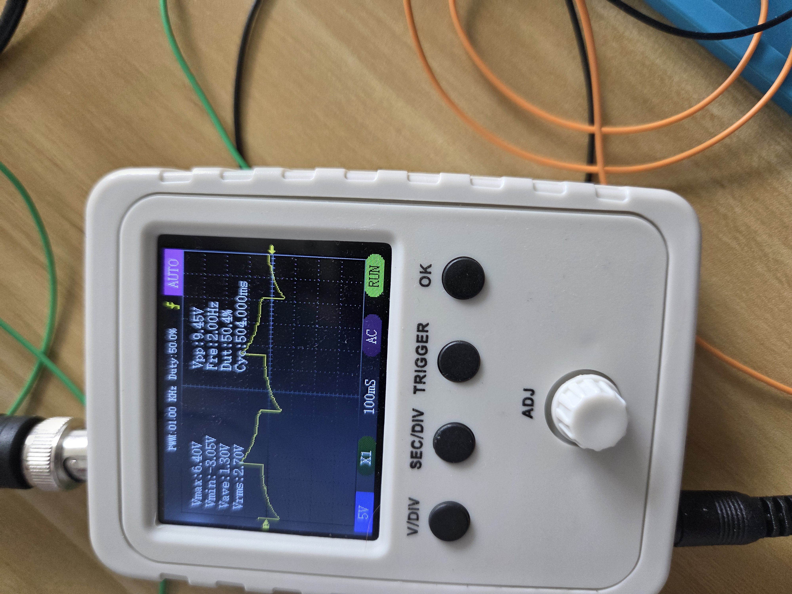

# Sat, 08.22.26 - Debugging the IC
After thinking about it for a week, I decided to make sure the IC was working correctly.

Step 1 is wiring this and instead of biasing, we're going to just ground one input and put a square wave in the other. If this works the way it *should*, the output should be the same as the square wave input. This will require a little code.

Welp, seems like the obsolete chips I got on ebay don't work very well. I'm going to try to cobble together an instrumentation amplifier from the opamps I currently have.

We did it!!
[Instrumentation amplifier link](https://www.ti.com/lit/an/sboa282a/sboa282a.pdf?ts=1787367482333)

[Amplifiers I used](https://www.ti.com/lit/ds/symlink/tl084.pdf?HQS=dis-dk-null-digikeymode-dsf-pf-null-wwe&ts=1787409812922&ref_url=http%253A%252F%252Fwww.baidu.com%252F)

## Input

## Output

I used two 10ks to get a gain of 2x. The only weird thing is my ref is off. Gonna try to figure that one out.

Idk if the ref problem is a circuit problem or just because my oscope is so cheap and bad. I have enough to start working through the actual EEG stuff!
