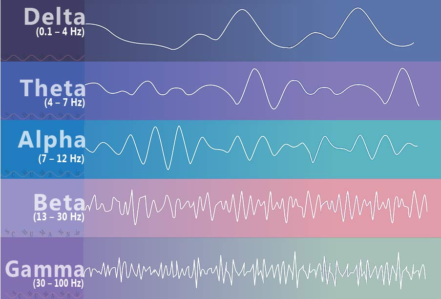
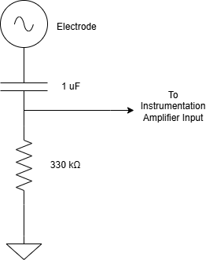

# Sat, 09.05.26 - High Pass Filter

It's been a while so I setup the circuit again and did some probing and testing at first just to be sure everything still worked and my cat didn't break anything. Not sure how she would do that but she's a schemer so it's possible.

## The need for a high pass filter

Basically ~~~ (input) too big. The DC component created by the contact between the skin and the electrode hits +/- 10V easily. This is problematic for the op amps in my instrumentation amplifier since I'm powering it at 9V. Inputs > 9V will saturate the op amp and all the peaks will be cut off. Also, my wee lil ADC on my arduino will be burned out by anything large than 5V.

> But why a high pass filter?

DC voltage is around 0 Hz by definition. If we filter out all signals with a frequency around 0 Hz, that voltage spike that makes my circuit sad goes away. This is a slight challenge with brain waves since Delta waves have a frequency of 0.1 Hz. Ya girl just wants this to be *close enough to a real EEG* so we're ignoring Delta waves for now.

## Designing the high pass filter

I chose a nice round 0.5 Hz as our cut-off frequency for the circuit. Ideally, everything that oscilates faster than 0.5 Hz (e.g. HIGHER frequencies) will be allowed through the filter. The HIGH frequencies, PASS through the filter. Our lower frequencies should be filtered out.

The formula for a High Pass filter cutoff frequency is `fc = 1 / (2πRC)`

I got some capacitors and made this circuit (well kinda, I used the wrong resistor because I forgot to read).

I'm planning to fix the circuit when I get home from my coffee shop and I'll post how it goes! If it works, I can expect a noisy looking signal in the range of +/- 100mv on my oscilliscope.