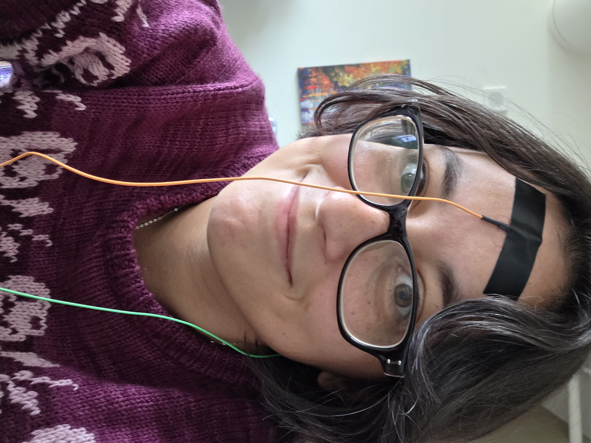
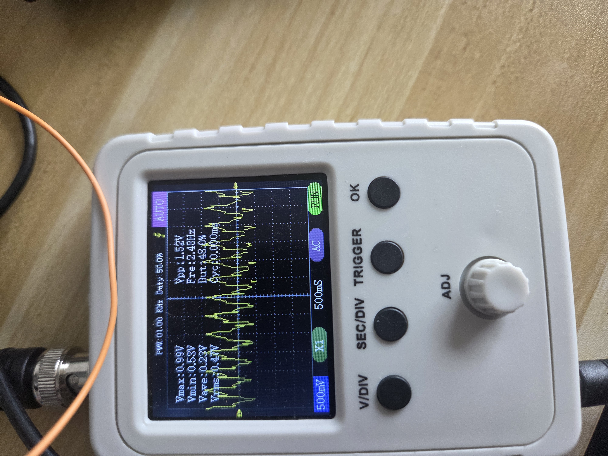
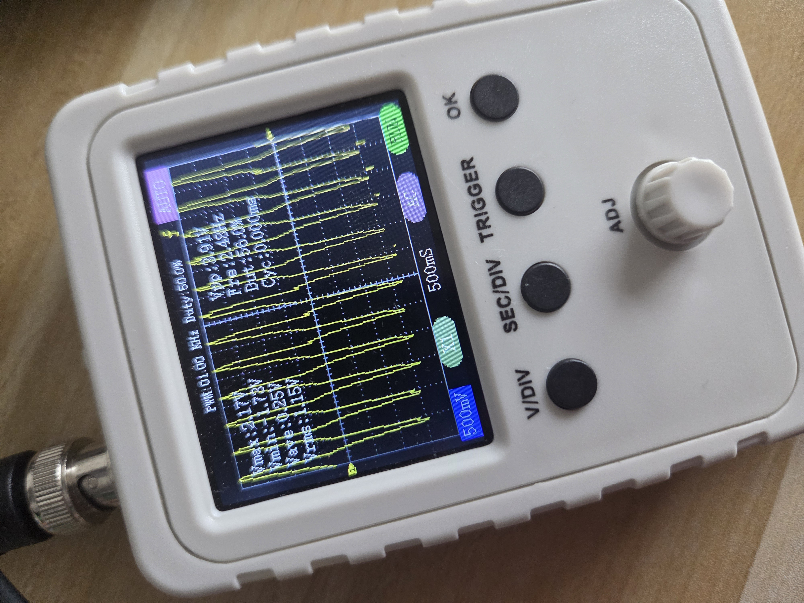
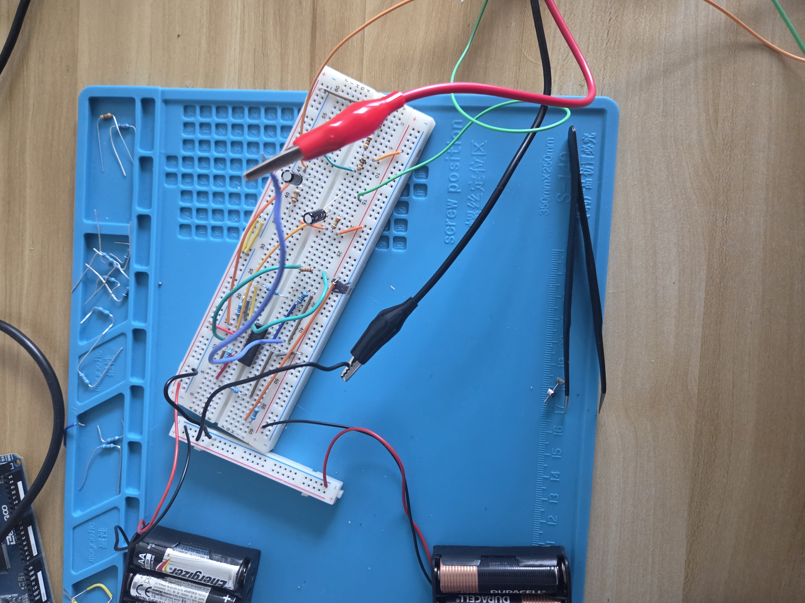

# Sat, 09.12.26 - Finishing a First Draft

The circuit is (kinda) done! 

## Second electrode

I added a second electrode that feeds into the second instrumentation amplifier input. I put the same high pass filter on the input as for the first electrode. The second electrode is part of a normal EEG setup that establishes a baseline of sorts for other electrodes that are used to actually capture brain waves. I stuck the second electrode behind my ear but next time I think I'll try my ear lobe.

## DC bias

I connected a voltage divider to a 9V rail using a 22k + 10k and a 10k to get a voltage of ~2.1V. I need the bias since the ADC on the arduino can't read negative voltage. However, my Oscope consistently shows negative voltages despite every DC portion of the circuit having the right voltage. I did wire one of the nodes a little confusingly so I'm going to re-do that in case I missed something.

## Gain resistor

I completed the circuit with a gain resistor of 20k for a gain of 2x. I was hoping this would result in a magic fix for the negative voltages but I still have them and they're worse because of the gain.

## Next steps

Honestly, if the voltage is within the range of my ADC capacity, I'm just going to hook the circuit up to the arduino and see if I get better measurements than my cheap Oscope. Which means I get to start writing software!! I'm pretty excited to try out some filtering and see if I can actually get a visualization of brain waves.

My oscope is a pretty limiting factor. It only has one channel and I have a suspicion that the sampling is inaccurate. I'm also noticing that the EEG signal from the electrode is a consistent looking wave form. That's really suspicious. I would expect a noisier looking signal so I'll need to dive into that.
